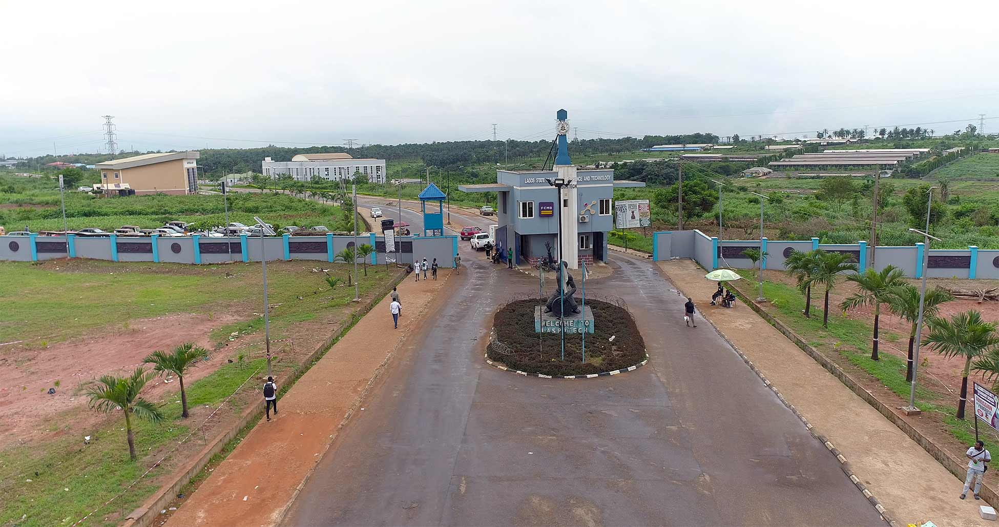

# LASUSTECH Network-Aware Adaptive E-Learning Platform



A state-of-the-art e-learning solution designed specifically for environments with varying network conditions. This platform utilizes "Network-Aware" technology to dynamically adjust content delivery, ensuring a seamless learning experience for students regardless of their internet speed.

## 🚀 Key Features

### 🌐 Network-Aware Adaptation
- **Lite Mode:** Automatically detects slow connections and replaces heavy images/videos with lightweight CSS-generated placeholders and text summaries.
- **Medium Mode:** Serves optimized, compressed media assets.
- **High Mode:** Delivers full high-definition content for stable, high-speed connections.
- **Real-time Monitoring:** Integrated network dashboard for users to track their current connectivity status.

### 🎓 Academic Management
- **Student Portal:** Course catalog, lesson viewer with progress tracking, assignment submission, and interactive quizzes.
- **Lecturer Dashboard:** Comprehensive tools for managing courses, creating quizzes, grading assignments, and tracking student performance.
- **Admin Suite:** System-wide health monitoring, user management, and platform configuration.

### 💬 Engagement Tools
- **Discussion Forums:** Threaded discussions for each course to facilitate peer-to-peer learning.
- **Progress Tracking:** Visualized learning data using interactive charts (Recharts).
- **Notifications:** Real-time feedback via hot-toasts for actions like submissions and login.

## 🛠️ Tech Stack

- **Frontend:** React 18, Tailwind CSS, React Router 6, Recharts, Axios.
- **Backend:** Node.js, Express, JWT Authentication, Multer (File Handling).
- **Database:** JSON-based persistent store (ready for MongoDB/PostgreSQL migration).
- **Deployment:** Optimized for Firebase, Railway, and Vercel.

## 🏁 Getting Started

### Prerequisites
- Node.js (v18 or higher)
- npm or yarn

### Installation

1. **Clone the repository:**
   ```bash
   git clone https://github.com/your-username/webportal.git
   cd webportal
   ```

2. **Install all dependencies:**
   ```bash
   npm run install:all
   ```

3. **Optimize Images (Highly Recommended for Performance):**
   To achieve a 100% Lighthouse score, run the image optimization script:
   ```bash
   cd client
   npm install sharp
   node scripts/optimize-images.mjs
   ```
   This script converts all assets to `.webp` and compresses them.

4. **Configure Environment Variables:**
   Create a `.env` file in the `server` directory and `client` directory based on the `.env.example` files provided.

### Running the Application

- **Development Mode (Both Client & Server):**
  ```bash
  npm run dev
  ```
  - Frontend: `http://localhost:3000`
  - Backend: `http://localhost:5000`

- **Production Build:**
  ```bash
  npm run build
  npm start
  ```

## 🧪 Demo Accounts
- **Admin:** `admin@lasustech.edu.ng` / `123456`
- **Lecturer:** `prof.basit@lasustech.edu.ng` / `123456`
- **Student:** `john.ola@student.lasustech.edu.ng` / `141414`

## 📄 License
This project is licensed under the MIT License.
